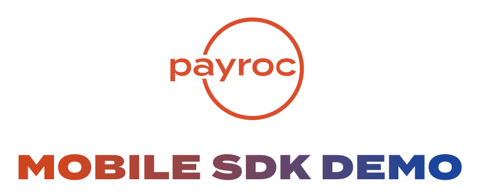

<p align="center">
<a href="https://github.com/payroc/mobile_sdks/wiki/iOS-MPOS-SDK"></a>
<a href="https://github.com/payroc/mobile_sdks/wiki/Android-MPOS-SDK"></a>

</p>

<p align="center">
    Made with ❤️ by <a href="https://www.payroc.com">Payroc LLC</a>.
</p>

## Overview

<table>
  <tr>
    <th>
      
    </th>
    <th>
      
    </th>
    <th>
    
    </th>
  </tr>
</table>

GIFs COMING SOON! STAY TUNED!

# Payroc Android SDK Demo App

Application demonstrating / testing the mobile SDK functions. 
SDK Docs for each supported platform are found [here](https://github.com/payroc/mobile_sdks/wiki)

This application is intended to give a baseline implementation for each of the individual functions that the [Payroc Mobile SDK](https://github.com/payroc/mobile_sdks) offers. This is in an effort to offer a semi-integrated solution certified with TSYS or Vantiv respectively. 

## Getting Started

### Dependencies
- Android Studio (target sdk 28, min 19)
- Kotliln
- JUnit4

### Demo App Setup

Clone the Demo App repo 
```bash
git clone https://github.com/payroc/android_sdk_demo_app.git
```

👍😄👍

Poof! thats it. Once you have the repo cloned, then you should be able to run the app right out of the box!

👍😄👍

### Additional Context 

We utilize the strengths of Fragments in Android to cleanly organize each typical use case for the SDK. This should give you a solid feel for how this can be applied to your App, or in some cases, you should be able to copy fragments, and views to your app and be able to use them out of the box with little added effort. 

__Note: Many pages here are intentionally left "bland" to aid in ease-of-styling if you do decide to use our template.__

## Versioning

We use [SemVer](http://semver.org/) for versioning on all projects. For the versions available, see the [tags on this repository](https://github.com/payroc/mobile_sdk/tags). 

## Authors

* **Preston Farr** - *Lead Mobile Developer* - [Payroc](https://github.com/payroc)

See also the list of [contributors](https://github.com/payroc/android_sdk_demo_app/contributors) who participated in this project.

## License

© All rights reserved Payroc LLC. 

## Acknowledgments

* [DSpread](https://gitlab.com/dspread) - MPOS SDK Provider for EMV Bluetooth Hardware 
